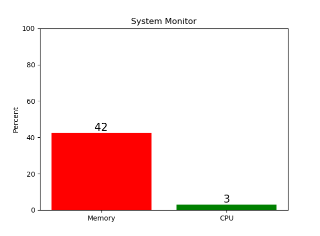

# Python-System-Monitor

A real-time Monitor on memory and CPU

## features

### Simple and clean GUI



### CLI support

Also display log on CLI, so it works on pure CLI environment

```
Mon Jun  4 16:50:31 2018        Mem: 43         CPU: 5
Mon Jun  4 16:50:32 2018        Mem: 43         CPU: 5
Mon Jun  4 16:50:33 2018        Mem: 43         CPU: 9
Mon Jun  4 16:50:34 2018        Mem: 43         CPU: 11
```

### Difinitions

$$Memory\ Usage=\frac{Used}{Total}$$

$$CPU\ Usage=\frac{BusyTime}{\Delta Time}=\frac{\Delta Time - IdleTime}{\Delta Time}$$

#### Example of get CPU idle time

[Linux Source Code: kernel/sched/cputime.c](https://github.com/torvalds/linux/blob/447976ef4fd09b1be88b316d1a81553f1aa7cd07/kernel/sched/cputime.c#L244)

```c++
// linux/kernel/sched/cputime.c
void account_idle_time(cputime_t cputime)
{
    u64 *cpustat = kcpustat_this_cpu->cpustat;
    struct rq *rq = this_rq();

    if (atomic_read(&rq->nr_iowait) > 0)
        cpustat[CPUTIME_IOWAIT] += (__force u64) cputime;
    else
        cpustat[CPUTIME_IDLE] += (__force u64) cputime;
}
```

Here we use a higher level of API, to achieve cross platform.

### LightWeight

only a few MB of memory cost, almost 0 CPU cost

### Adaptive refresh rate

default 1s, minium 10ms

### Cross platform

Support almost all platforms, including Linux, macOS and Windows

### Program language

Based on Python, runs well on both Python2 and Python3

### Open source on GitHub 
[Repo](https://github.com/modricwang/Python-System-Monitor)
